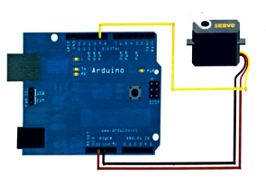

# Arduino RC Car – *AS4800-1 Project*

[](https://www.arduino.cc/)  
An Arduino-based project integrating hardware design, motor control, and real-time embedded systems to build a fully functional remote-controlled car.

---

## 🧠 About the Project

**Arduino RC Car AS4800-1** is a fully designed and built remote-controlled (RC) car developed for the **High School Final Exam (Esame di Stato 2017)** at **ITIS Giordano Bruno Budrio (Electronics)**.  
The project merges hardware, electronics, and embedded software, using **Arduino UNO** as the central control unit.

The car is equipped with:

- A **brushless motor** controlled via PWM signals.
- A **servo motor** for steering.
- **LED indicators** and an **RGB LED** for car status visualization.
- An **infrared receiver** for remote command handling.

All the electronics are carefully integrated on a custom breadboard circuit, ensuring robustness and modularity.

> 🎯 Project developed by **Andrea Perna** and **Samuele Pecci**, supervised by **Bahaman Gandomì**, **Piero Pasotti**, and **Giorgio DiPaola Antonio**.

---

## 🗂 Project Structure

```
📦 Arduino-RC-Car-AS4800-1/
┣ 📁 Images/
┃ ┣ 📸 circuit.png                     # Electrical circuit schematic
┃ ┣ 📸 car.png                         # Final assembled car
┃ ┣ 📸 block_diagram.png               # Schematic diagram
┃ ┣ 📸 system.jpg                      # Complete system setup
┣ 📘 Exam_Thesis.pdf                   # Full technical report (Italian)
┣ 📘 Exam_Presentation.pdf             # Final project presentation (slides)
┗ 📄 README.md                         # This file
```

---

## 🚗 Car System Overview

The RC car was based on a **WLtoys A959** 1/18 scale 4WD model, completely customized to:

- Replace the original electronics with a custom Arduino-based control board.
- Replace the brushed motor with a **Racestar 2435 4800KV brushless motor**.
- Integrate a **25A ESC (Electronic Speed Controller)**.
- Control the steering via a **17g FMS Servo Motor**.

Power is provided by a **7.4V 1600mAh LiPo Battery** optimized for high discharge rate applications.

---

## 🔌 Hardware Components

| Component                | Role                                                                 |
|---------------------------|---------------------------------------------------------------------|
| **Arduino UNO**           | Central control unit (PWM motor + servo + LED management)           |
| **Brushless Motor**       | Main driving system (controlled via ESC and PWM)                    |
| **ESC 25A**               | Electronic Speed Controller for brushless motor management         |
| **FMS 17g Servo**         | Steering mechanism                                                 |
| **LED Indicators**        | Directional turn signals (right/left indicators)                   |
| **RGB LED**               | Car status: Stop (Red), Forward (Blue), Reverse (Green)             |
| **Infrared Receiver**     | Remote control interface                                           |
| **LiPo Battery 7.4V 1600mAh** | Main power source for electronics and motors                |

---

## 🎯 Project Overview

📸 **Electronic Circuit**  
<p align="center">
  
  
</p>

📸 **Final Assembled RC Car**  
<p align="center">
  
  
</p>

---

## 🎮 Remote Control System

The RC commands were interpreted using an **infrared remote**, where each button maps to specific actions:

| Button            | Function                     |
|-------------------|-------------------------------|
| UP                | Move Forward                  |
| DOWN              | Move Backward                 |
| LEFT              | Turn Left                     |
| RIGHT             | Turn Right                    |
| ENTER             | Stop Car                      |

Commands are received at 38kHz using a standard IR receiver connected to Arduino.

The signals were processed using the Arduino `IRRemote.h` library.

---

## ⚙️ Motor and Servo Control Logic

**Brushless Motor via ESC**:
- Controlled using **PWM signals** generated by Arduino.
- Three motor states:
  - 90 PWM value → Stop
  - >90 PWM value → Forward Movement
  - <90 PWM value → Reverse Movement

**Servo Motor for Steering**:
- Controlled via **Arduino Servo library**.
- Three steering angles:
  - 80° → Center
  - 60° → Left
  - 110° → Right

Precise steering and motion control were crucial for stable driving behavior at high speed.

---

## 🌈 LED Status Indicators

| LED Type | Color   | Meaning                         |
|----------|---------|---------------------------------|
| RGB LED  | Red     | Vehicle stopped                 |
| RGB LED  | Blue    | Moving forward                  |
| RGB LED  | Green   | Moving backward                 |
| Side LEDs | Orange | Left/Right turn indicators       |

This system provided real-time feedback about the car's operational state.

---

## 📎 Resources

- 📘 [Full Technical Report (PDF)](./Exam_Thesis.pdf)
- 📘 [Final Presentation (PDF)](./Exam_Presentation.pdf)

---

## 👨‍🎓 Authors

- Andrea Perna  
- Samuele Pecci  

📧 and.perna99@gmail.com

---

## 👩‍🏫 Supervisors

- Prof. Bahaman Gandomì  
- Prof. Piero Pasotti  
- Prof. Giorgio DiPaola Antonio  

---

## 📜 License

All rights reserved. Educational and demonstrative use only.

---
